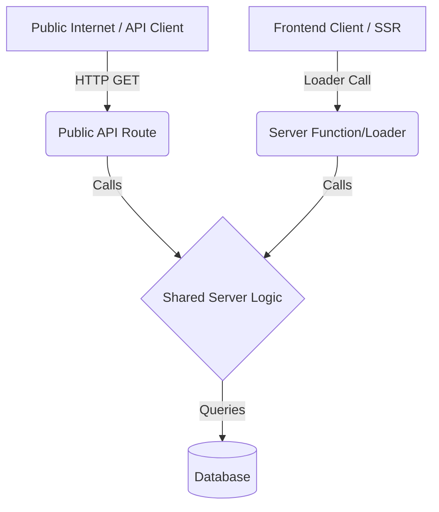

# Server Side Rendering & API Architecture

## Overview

This document outlines required architecture for Server Side Rendering (SSR) and API routes in Thesivest application.

## Core Principle

**"Everything rendered has a publicly exposed API route."**

## Implementation Pattern

For every feature or page that requires data fetching:

1.  **Public API Route**:

    - Create an API route (e.g., in `app/routes/api/...` or `server/api/...`).
    - This route is publicly accessible via an HTTP endpoint.
    - It returns JSON data.

2.  **Server Loader/Function**:

    - Create a server-side loader or server function (using TanStack Start `createListLoader` or `createServerFn`).
    - This function is used by the frontend component for SSR.
    - It calls the same shared logic as the API route.

3.  **Shared Logic**:
    - **Crucial**: Both the Public API Route and the Server Loader MUST call the _same_ shared logic function.
    - The shared logic lives on the server (e.g., in `src/server/` or a `services` folder).
    - It handles the actual database queries or business logic.

## Abstraction



## Example Structure

- `src/server/features/stocks.ts`: (Shared Logic) `export const getUnderRadarStacks = ...`
- `src/routes/api/stocks.ts`: (API Route) Calls `getUnderRadarStacks`.
- `src/routes/index.tsx`: (Page/Loader) Calls `getUnderRadarStacks` via `createServerFn`.

## Tech Stack & Project Rules

- **Package Manager**: `pnpm` (strictly use pnpm, do not use npm or yarn).
- **Styling**: Tailwind CSS (via `@tailwindcss/vite`). It is important to use themes and follow the tailwind variables set inside of themes when building. Do not come up with your own colors, follow the theme of the site.
- **UI Components**: shadcn/ui.
- **Authentication**: Better Auth (Note: Peer dependencies have been manually resolved).

## Database

- Use `pnpm db:push` to synchronize the schema with the Neon database.

---

# Homepage Improvements (v1.0)

## Overview

Updated the homepage to be product-focused and remove misleading claims, since the app doesn't have real users yet.

## Changes Made

### 1. Hero Section

- **Before**: Generic messaging with social proof
- **After**: Product-focused tagline that explains what users can do
  - Tagline: "A platform for disciplined investing. Document your investment thesis before you buy, track your performance automatically, and build a track record that attracts followers who learn from your process."

### 2. Removed Fake Social Proof

- **Removed**: Social proof stats bar (2,400+ investors, $12M+ trades tracked, 18.5% average return)
- **Reason**: No real users yet, so metrics would be misleading

### 3. Core Features Section

Added a new 3-card feature section explaining key platform capabilities:

- **Track Your Portfolio**: Create your portfolio and track every trade with automatic price updates. Monitor performance in real-time with comprehensive analytics including win rate, returns, and risk metrics.
- **Document Your Thesis**: Before every trade, write down your investment thesis. Document entry price, target price, stop loss, and reasoning behind your decision. Build a track record you can be proud of.
- **Build Your Following**: Share your insights with the community. As you build a proven track record, you'll attract followers who learn from your research and investment process.

### 4. Get Started in Minutes

Added a 4-step onboarding flow:

1. **Sign Up**: Create your free account in seconds. No credit card required.
2. **Add Your Thesis**: Document your research, entry price, and target before buying.
3. **Track Performance**: Automatic price updates show you how your thesis plays out.
4. **Build Reputation**: Share insights and grow your community of followers.

### 5. Example Community Posts

- **Made fully clickable** - Wrapped each post card in `<Link>` component
- Links to `/posts/:id` route (ready for implementation)
- Allows users to click anywhere on the card to view details

### 6. Removed Sections

- **Removed**: "Active Community Members" section (fake investor profiles)
- **Removed**: "Why Thesivest?" comparison section (differentiation from competitors)
- **Removed**: Testimonials section (fake investor success stories)
- **Reason**: Don't want dummy data on site until real users exist

### 7. Updated Realistic Data

- Changed mock symbols to real companies:
  - `RGNB` → `PACW` (PacWest Bancorp)
  - `AIINF` → `VST` (Vesta Technology)
  - `NEURO` → `ARWR` (Arrowhead Research)
  - `LITH` → `ALB` (Albemarle)
  - `MFG` → `TWNK` (Tower Semiconductor)
- Updated prices and returns to be realistic

### 8. Final CTA Section

- **Updated**: Clearer call-to-action with single strong button
  - Title: "Start Documenting Your Investment Thesis"
  - Description: "Create your free account and begin tracking your investment journey. Every trade you post builds your track record."
  - Button: "Create Free Account"
  - Removed: "Browse Tournaments" button (simplified to one CTA)

---

# Post Detail Page

## Overview

Created a new dynamic route for viewing individual post details with full information display.

## Route

- **Path**: `/posts/:id`
- **Method**: GET
- **Components**: Uses existing Card components from shadcn/ui
- **Loader**: Fetches post and member data using `getPostsByUser()` and `getContributorById()`

## Features

### 1. Author Information Display

- Avatar with user initials
- Full name or club name
- Username handle (@username)
- Club badge indicator
- Bio with line-clamp

### 2. Post Content

- Type badge (Trade/Thought/Update) with color coding
- Publication date
- Title and description
- Tags with icons

### 3. Trade-Specific Details

For trade posts only:

- **Entry Price**: Displayed prominently
- **Current Price**: With comparison arrow showing change
- **Target Price**: If set
- **Stop Loss**: With warning styling (red color)
- **Entry Thoughts**: Investor's reasoning behind the decision

### 4. Performance Metrics

- **Return Percentage**: Color-coded (green for wins, red for losses, neutral for active)
- **Status Badge**: Active/Win/Loss indicator
- Formatted percentage with ± sign

### 5. Thought/Update Details

For thoughts and updates:

- **Published Date**: With calendar icon
- **Context Description**: Differentiates between thoughts and updates
- Thoughts: "This is an investment thought or analysis shared by an investor."
- Updates: "This is an update to a previously shared trade position."

### 6. Engagement Metrics

- Views count with Eye icon
- Likes count with Heart icon
- Comments count with Clock icon

### 7. Responsive Design

- Grid layout for trade details (2 columns)
- Mobile-friendly with proper spacing
- Consistent with homepage styling (glassmorphism, Tailwind variables)

### 8. Navigation

- Back to Home button
- Clear visual hierarchy

---

# TypeScript Improvements

## Server Function Typing with Zod

Added comprehensive Zod typing documentation to `agent.md` to help developers understand how to properly use Zod validation with TanStack Start server functions.

### How to Use Zod with TanStack Start

When using `createServerFn` in TanStack Start:

- Import `z` from `zod`
- Use `.validator()` method to define input schema with Zod
- Access validated input in handler via `input` property (not `params`)
- Remove `as` type assertions (Zod handles this)

### Example Code

```typescript
import { z } from "zod";
import { createServerFn } from "@tanstack/react-start";

const getPostFn = createServerFn({ method: "GET" })
  .inputValidator((z) =>
    z.object({
      id: z.string(),
    })
  )
  .handler(async ({ input: { id } }) => {
    // id is now properly typed
    return { id };
  });
```

### TanStack Router Parameter Access

When using file routes with `params`:

- Use `params` object directly (TanStack Router handles typing)
- Access route parameters with `params.id` (not `params as { id: string }`)
- No type assertions needed

### Example

```typescript
const Route = createFileRoute("/posts/$id")({
  loader: async ({ params }) => {
    // params is properly typed
    const { id } = params;
    // ... use id directly
  },
});
```

---

# Database Schema Reference

The current database schema (`src/db/schema.ts`) only includes authentication tables:

- `user` - User accounts with profile fields
- `session` - User sessions
- `account` - OAuth accounts
- `verification` - Email verification tokens

### Proposed Schema (not yet implemented)

From `docs/database-schema-proposal.md`:

- `post` - Trade/thought/update posts with full metadata
- `post_tag` - Many-to-many relationship with tags
- `tag` - Tag definitions
- `trade_performance` - Performance tracking
- `follow` - User following system
- `post_like` - Like system
- `comment` - Comment system
- `tournament_participant` - Tournament participation

### Implementation Note

Until real users exist, all data comes from mock data in `src/server/features/contributors.ts`. When implementing real database features, create tables in the schema proposal and replace mock data functions with actual database queries.

---

# Mock Data References

All current community and tournament data is mocked in:

- `src/server/features/contributors.ts` - Posts and member data
- `src/server/features/tournaments.ts` - Tournament data
- `src/lib/chartData.ts` - Portfolio comparison data

When transitioning to real data:

1. Create database tables as per schema proposal
2. Update shared logic functions to query database
3. Update loaders to use real data instead of mocks
4. Keep API routes for public access
5. Maintain same interface for SSR (server functions calling shared logic)

---

# Development Guidelines

## Before Submitting Work

1. **Run `pnpm build`** - Ensure production build succeeds
2. **Check TypeScript compilation** - Strict mode enabled (`noUnusedLocals`, `noUnusedParameters`)
3. **Verify database migrations** - Run `pnpm db:push` if schema changed
4. **Ensure API routes work** - Both public API and SSR loaders must call same shared logic
5. **Follow theme colors** - Use Tailwind variables, not custom colors
6. **Test all features** - Use Vitest and Testing Library

## TypeScript Typing Rules

### Strict Type Safety

1. **No `any` types allowed**:

   - Never use `any` in the codebase
   - Use proper types from the database schema
   - If a type doesn't exist, define it properly using the schema types

2. **No `as any` assertions**:

   - Never use `as any` to bypass type checking
   - If you need to cast, use proper type guards or schema types
   - Trust the schema - it defines your types

3. **Let TypeScript infer return types from Drizzle**:
   - **Do not explicitly define return types** on functions that return data from Drizzle queries
   - Let TypeScript infer the return type automatically from the database operations
   - Only manually type return values when complex data manipulation makes the return value significantly different from the schema
   - This reduces verbosity and maintains type safety

### Examples

**BAD - Using `any`**:

```typescript
export async function getPosts(): Promise<any[]> {
  return db.select().from(post);
}
```

**BAD - Explicitly typing simple Drizzle queries**:

```typescript
export async function getPosts(): Promise<(typeof post.$inferSelect)[]> {
  return db.select().from(post);
}
```

**GOOD - Let TypeScript infer from Drizzle**:

```typescript
export async function getPosts() {
  return db.select().from(post);
}
```

**BAD - Using `as any`**:

```typescript
const tournaments = await db.select().from(tournament);
return tournaments.map((t: any) => ({
  id: t.id,
  name: t.name,
}));
```

**GOOD - Using schema types**:

```typescript
const tournaments = await db.select().from(tournament);
return tournaments.map((t) => ({
  id: t.id,
  name: t.name,
}));
```

**BAD - Manual type definitions**:

```typescript
export interface Tournament {
  id: string;
  name: string;
  description: string;
  category: string;
  // ... duplicated from schema
}
```

**GOOD - Let TypeScript infer**:

```typescript
// TypeScript automatically infers the type from db.select().from(tournament)
export async function getTournaments() {
  return db.select().from(tournament);
}
```

**OKAY - Manual typing for complex transformations**:

```typescript
// Only when the return structure is significantly different
export interface TournamentWithStats {
  participantCount: number;
  averageScore: number;
  topPerformers: User[];
  tournament: typeof tournament.$inferSelect;
}

export async function getTournamentWithStats(
  id: string
): Promise<TournamentWithStats> {
  // ... complex query with joins and aggregations
}
```

## Key Architecture Patterns

### API Route Pattern

```typescript
// API Route
import { createFileRoute } from "@tanstack/react-router";
import { getUnderRadarTheses } from "../../server/features/theses";

export const Route = createFileRoute("/api/theses")({
  server: {
    handlers: {
      GET: async ({ request }) => {
        const theses = await getUnderRadarTheses();
        return new Response(JSON.stringify(theses), {
          headers: { "Content-Type": "application/json" },
        });
      },
    },
  },
});
```

### Server Function Pattern

```typescript
// Server Function (SSR)
import { createServerFn } from "@tanstack/react-start";
import { getUnderRadarTheses } from "../../server/features/theses";

const getThesesFn = createServerFn({ method: "GET" }).handler(async () => {
  return await getUnderRadarTheses();
});

// In route file
import { createFileRoute } from "@tanstack/react-router";
import { useLoaderData } from "@tanstack/react-router";
import { getThesesFn } from "../server/fn/getTheses";

export const Route = createFileRoute("/")({
  component: Home,
  loader: async () => {
    return await getThesesFn();
  },
});
```

Both call the SAME shared logic function `getUnderRadarTheses()`.
