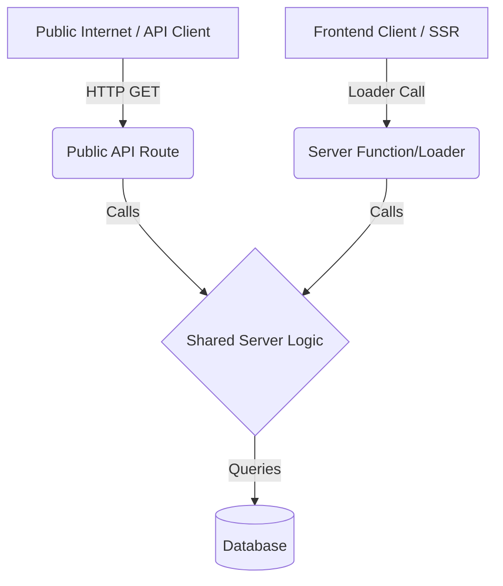

# Server Side Rendering & API Architecture

## Overview

This document outlines the required architecture for Server Side Rendering (SSR) and API routes in the Thesivest application.

## Core Principle

**"Everything rendered has a publicly exposed API route."**

## Implementation Pattern

For every feature or page that requires data fetching:

1.  **Public API Route**:

    - Create an API route (e.g., in `app/routes/api/...` or `server/api/...`).
    - This route is publicly accessible via an HTTP endpoint.
    - It returns JSON data.

2.  **Server Loader/Function**:

    - Create a server-side loader or server function (using TanStack Start `createListLoader` or `createServerFn`).
    - This function is used by the frontend component for SSR.

3.  **Shared Logic**:
    - **Crucial**: Both the Public API Route and the Server Loader MUST call the _same_ shared logic function.
    - The shared logic lives on the server (e.g., in `src/server/` or a `services` folder).
    - It handles the actual database queries or business logic.

## Abstraction

## Example Structure

- `src/server/features/stocks.ts`: (Shared Logic) `export const getUnderRadarStacks = ...`
- `src/routes/api/stocks.ts`: (API Route) Calls `getUnderRadarStacks`.
- `src/routes/index.tsx`: (Page/Loader) Calls `getUnderRadarStacks` via `createServerFn`.

## Tech Stack & Project Rules

- **Package Manager**: `pnpm` (strictly use pnpm, do not use npm or yarn).
- **Styling**: Tailwind CSS (via `@tailwindcss/vite`). It is important to use themes and follow the tailwind variables set inside of themes when building. Do not come up with your own colors, follow the theme of the site.
- **UI Components**: shadcn/ui.
- **Authentication**: Better Auth (Note: Peer dependencies have been manually resolved).

## Database

- Use `pnpm db:push` to synchronize the schema with the Neon database.
